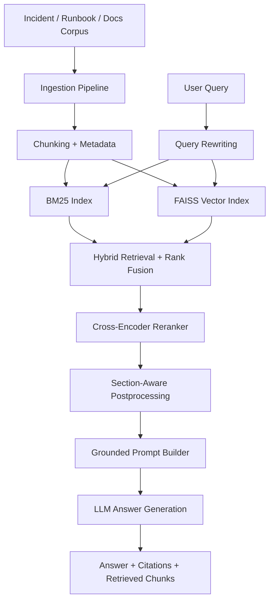

# IncidentMemory AI

IncidentMemory AI is a production-style RAG system for engineering incident knowledge.

It ingests:
- incident postmortems
- runbooks
- architecture docs
- optional GitHub issues and PRs

It provides:
- grounded answers with citations
- hybrid retrieval (BM25 + vector search)
- query rewriting and reranking
- section-aware ranking for root-cause and mitigation queries
- evaluation metrics (Recall@k, MRR)
- structured logging and basic safety guardrails

## Why This Project Matters

Most RAG portfolios are generic document chatbots. This project is different: it focuses on operational memory for engineers and demonstrates the parts of RAG systems that matter in real production work, including retrieval quality, evaluation, observability, and safety.

## Demo Use Cases

- `What was the root cause of the search latency incident?`
- `What fixed the checkout timeout incident?`
- `What runbook steps help with database latency?`
- `Which document describes checkout failure modes?`

## Current Results

On the current benchmark set:
- Average Recall@1: `0.75`
- Average Recall@3: `1.00`
- Average Recall@5: `1.00`
- Average MRR: `0.88`

These numbers reflect a retrieval stack that consistently finds the right document in the top results, with room for future improvement in citation ranking precision.

## Screenshots

### Root Cause Lookup


### Mitigation Lookup


### Retrieved Evidence Panel


### Evaluation Output


## Architecture



## Repo Structure

```text
app/
core/
ingestion/
retrieval/
rerank/
evals/
ui/
tests/
scripts/
docker/
data/
README.md
LICENSE
Makefile
requirements.txt
requirements-dev.txt
```

## Local Setup

```bash
git clone https://github.com/vamsi513/incident-memory-ai.git
cd incident-memory-ai
python3.11 -m venv .venv
source .venv/bin/activate
pip install -r requirements.txt -r requirements-dev.txt
cp .env.example .env
```

Then run the pipeline:

```bash
python -m scripts.run_ingestion
python -m scripts.build_index
uvicorn app.main:app --reload --port 8001
streamlit run ui/streamlit_app.py
```

Open:
- UI: `http://localhost:8501`
- API docs: `http://127.0.0.1:8001/docs`

## Example API Request

```bash
curl -X POST http://127.0.0.1:8001/query \
  -H "Content-Type: application/json" \
  -d '{"query":"What fixed the checkout timeout incident?"}'
```

## Retrieval Design

The retrieval stack is intentionally more advanced than a basic vector-search demo:

1. Documents are chunked by section so that `Root Cause`, `Mitigation`, and runbook procedure blocks remain distinct retrieval units.
2. Queries are rewritten into retrieval-friendly variants.
3. Hybrid retrieval combines BM25 lexical search with FAISS semantic search.
4. Reciprocal-rank fusion merges candidate sets.
5. A cross-encoder reranker improves final ordering.
6. Section-aware postprocessing boosts chunks that match the intent of the query, such as `Root Cause` or `Mitigation`.

## Evaluation

The project includes a benchmark-driven evaluation pipeline.

Current metrics are produced from:
- [`evals/dataset.json`](evals/dataset.json)
- [`evals/metrics.py`](evals/metrics.py)
- [`scripts/run_evals.py`](scripts/run_evals.py)

Run it locally with:

```bash
python -m scripts.run_evals
```

## Security and Safety

The system includes basic guardrails that are important for real-world RAG projects:

- grounded prompting with citation requirements
- `I don't know` fallback when evidence is insufficient
- basic prompt-injection detection patterns
- basic PII masking helpers
- structured query logging

## Optional Deployment Path

A hosted deployment is optional for this project. The local demo and repository are already strong enough for resume, GitHub, LinkedIn, and interview use.

If you still want to deploy later:
- Backend: Render or Railway
- UI: Streamlit Community Cloud

For the frontend, set:

```env
API_BASE_URL=https://YOUR-BACKEND-URL
```

Then deploy [`ui/streamlit_app.py`](ui/streamlit_app.py).

## Known Limitations

- Retrieval quality is strong for the benchmark, but the top-ranked citation is not always the strongest evidence chunk.
- Hosted deployment is optional and not yet polished because the ML/runtime footprint is heavier than a typical FastAPI app.
- The polished demo corpus currently focuses on local markdown incidents, runbooks, and architecture docs.

## Next Improvements

- add GitHub issue / PR ingestion into the main demo path
- add parent-child retrieval
- add feedback capture in the UI
- add stronger retrieval-focused tests
- split runtime and development dependencies more cleanly

## License

This project is licensed under the MIT License. See [`LICENSE`](LICENSE).
