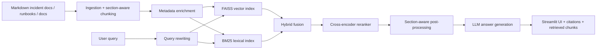

# IncidentMemory AI

IncidentMemory AI is a production-style RAG system for engineering incident knowledge. It ingests incident postmortems, runbooks, architecture docs, and issue-style operational notes, then answers incident-response questions with grounded citations and retrieval traces.

This is not a generic PDF chatbot. The repo is built to demonstrate the parts recruiters and interviewers expect from an LLM engineer:
- hybrid retrieval (`BM25 + FAISS embeddings`)
- query rewriting
- reranking with a cross-encoder
- section-aware ranking heuristics for `Root Cause` and `Mitigation`
- grounded generation with citation requirements and `I don't know` fallback
- retrieval evaluation with `Recall@k` and `MRR`
- structured logging and basic prompt-injection defenses

## Demo Use Cases

- "What was the root cause of the search latency incident?"
- "What fixed the checkout timeout incident?"
- "What runbook steps help with database latency?"
- "Which document describes checkout failure modes?"

## Current Results

Retrieval baseline on the demo corpus:
- `Recall@1`: `0.75`
- `Recall@3`: `1.00`
- `Recall@5`: `1.00`
- `MRR`: `0.88`

Observed behavior after ranking fixes:
- `search latency root cause` answers correctly
- `database latency runbook steps` answers correctly
- `checkout timeout root cause` answers correctly
- `checkout timeout fixed` answers correctly with mitigation evidence

## Architecture



## Repo Structure

```text
app/          FastAPI app, schemas, prompts, OpenAI generation
core/         config, logging, security helpers
ingestion/    loaders, chunking, metadata enrichment
retrieval/    embeddings, BM25, hybrid retrieval, reranking post-processing
rerank/       cross-encoder reranker
evals/        evaluation dataset and metrics
ui/           Streamlit frontend
scripts/      ingestion, indexing, eval, and local test entrypoints
data/         demo corpus and processed retrieval artifacts
docker/       backend container definition
```

## Local Setup

### 1. Create the environment

```bash
python3.11 -m venv .venv
source .venv/bin/activate
pip install -r requirements.txt -r requirements-dev.txt
```

### 2. Configure environment variables

Copy `.env.example` to `.env` and fill in:
- `OPENAI_API_KEY`
- `GITHUB_TOKEN` if you want GitHub ingestion later

Important local value:

```env
API_BASE_URL=http://127.0.0.1:8001
```

### 3. Build demo artifacts

```bash
python -m scripts.run_ingestion
python -m scripts.build_index
python -m scripts.run_evals
```

### 4. Run the backend

```bash
uvicorn app.main:app --reload --port 8001
```

### 5. Run the UI

In a separate terminal:

```bash
streamlit run ui/streamlit_app.py
```

Open:

```text
http://localhost:8501
```

## Example API Request

```bash
curl -X POST http://127.0.0.1:8001/query \
  -H "Content-Type: application/json" \
  -d '{"query":"What fixed the checkout timeout incident?"}'
```

## Retrieval Design

The retrieval stack is intentionally layered:

1. Documents are chunked by section so `Root Cause`, `Mitigation`, and `Immediate Checks` remain distinct retrieval units.
2. Queries are rewritten to generate retrieval-friendly variants.
3. Candidate generation uses both semantic search and lexical BM25 search.
4. Results are fused with reciprocal rank fusion.
5. A cross-encoder reranker re-scores candidate relevance.
6. Section-aware post-processing boosts the exact section type implied by the query.

This makes the system more robust than naive vector-only retrieval and easier to explain in interviews.

## Evaluation

Run:

```bash
python -m scripts.run_evals
```

The current evaluation dataset covers:
- incident root-cause lookup
- mitigation / fix lookup
- runbook procedural lookup
- architecture / failure-mode lookup

## Security and Safety

- system prompt explicitly distrusts instructions found inside retrieved documents
- basic prompt-injection pattern detector in `core/security.py`
- basic PII masking helper for emails
- grounded generation rule: answer only from retrieved evidence or return `I don't know`

## Deployment

### Backend: Render

- `render.yaml` is included
- backend Dockerfile is in [`docker/Dockerfile.api`](/Users/vamsi/Documents/IncidentMemoryAI/docker/Dockerfile.api)
- set production env vars in Render, especially `OPENAI_API_KEY`

### UI: Streamlit Community Cloud

Set:

```env
API_BASE_URL=https://YOUR-RENDER-BACKEND.onrender.com
```

Then deploy `ui/streamlit_app.py`.

## What Makes This Project Interview-Worthy

- It solves a realistic operational-memory problem, not generic document chat.
- It demonstrates retrieval, reranking, evals, observability, and safety.
- It includes a measurable benchmark and a live, inspectable UI.
- It shows pragmatic ranking improvements beyond default vector search.

## Recommended Demo Script

1. Ask for the root cause of the search latency incident.
2. Show citations and retrieved chunks.
3. Ask what fixed the checkout timeout incident.
4. Show that the system now retrieves the `Mitigation` section.
5. Show the evaluation results and explain how ranking was improved.

## Next Improvements

- add GitHub issue / PR ingestion into the main demo path
- add parent-child retrieval
- add feedback capture in the UI
- add cost / latency tracking per request
- deploy the backend and frontend with public demo links
