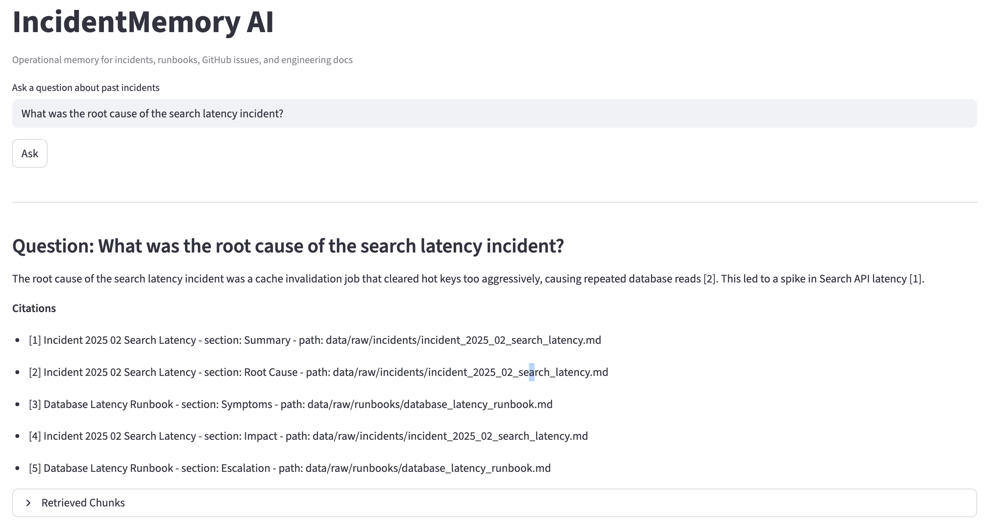
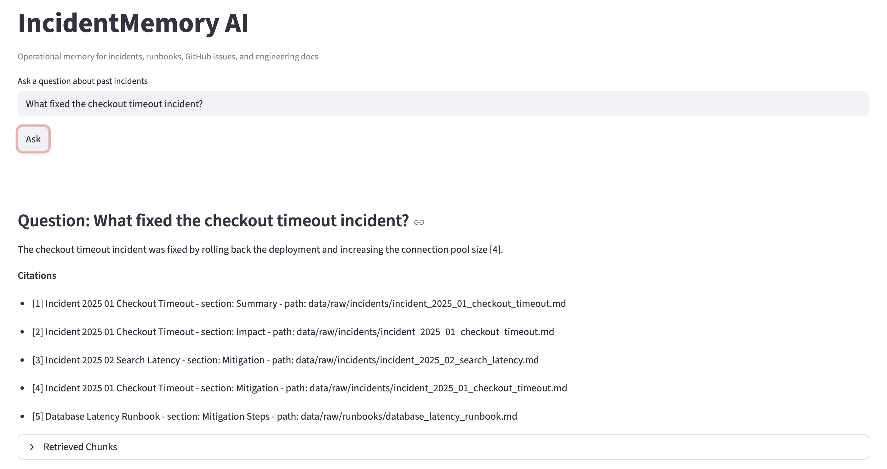
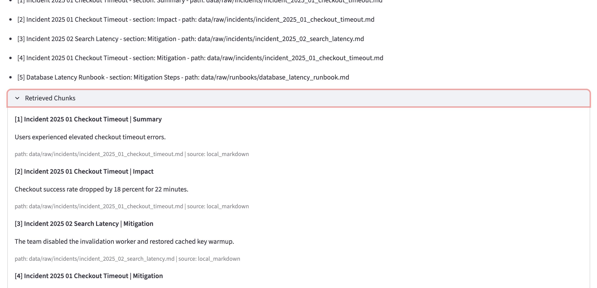
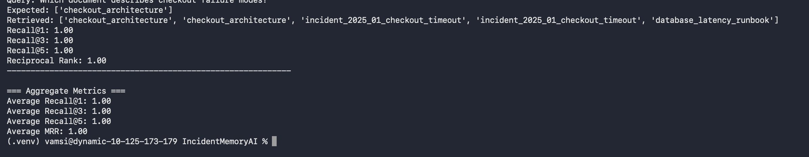

# IncidentMemory AI

IncidentMemory AI is a production-style Retrieval-Augmented Generation (RAG) system for engineering incident knowledge. It is designed to act as an operational memory layer for postmortems, runbooks, and architecture documents, allowing engineers to query prior failure modes, root causes, mitigations, and recovery procedures with grounded citations.

This project is intentionally positioned beyond a generic "PDF chatbot." The engineering focus is on retrieval quality, reranking, evaluation, observability, and system design decisions that are relevant to AI/ML systems roles.

## What This System Does

- Ingests operational knowledge sources such as incident documents and runbooks
- Retrieves relevant evidence using hybrid search (keyword + vector)
- Reranks candidate chunks before answer generation
- Returns grounded answers with supporting citations
- Exposes an API layer and worker layer for production-style extension
- Includes an evaluation module for measuring retrieval quality

## Architecture

The repository is organized around clear service boundaries:

- [api](/Users/vamsi/Documents/New%20project/api): FastAPI application, routes, dependency wiring
- [core](/Users/vamsi/Documents/New%20project/core): config, DB/Qdrant connections, logging, tracing, provider factories, shared exceptions
- [services](/Users/vamsi/Documents/New%20project/services): ingestion, BM25 retrieval, vector retrieval, hybrid retrieval, reranking, parent retrieval
- [schemas](/Users/vamsi/Documents/New%20project/schemas): request/response contracts and typed data models
- [workers](/Users/vamsi/Documents/New%20project/workers): background task and queue scaffolding
- [eval](/Users/vamsi/Documents/New%20project/eval): retrieval evaluation entry point
- [tests](/Users/vamsi/Documents/New%20project/tests): API, generator, and integration test coverage

## Current Capabilities

- Hybrid retrieval using BM25 and vector similarity
- Cross-encoder reranking
- Parent-document retrieval scaffolding for larger contexts
- Typed request/response schemas with Pydantic
- Async FastAPI service layer
- Structured logging and tracing placeholders
- Evaluation harness for retrieval hit-rate style benchmarking
- Containerized local environment with Postgres, Redis, and Qdrant

## Evaluation

The repository includes a retrieval evaluation scaffold in [eval/ragas_runner.py](/Users/vamsi/Documents/New%20project/eval/ragas_runner.py). Despite the filename, the current implementation is a custom retrieval-quality runner rather than a full RAGAS integration.

Today it is best interpreted as:

- a benchmark entry point
- a place to grow retrieval metrics
- a reproducible evaluation surface for ablations and regressions

Representative metrics currently tracked in local runs include:

- Recall@1
- Recall@3
- Recall@5
- Mean Reciprocal Rank (MRR)

## Screenshots

Add the screenshots below into [docs/screenshots](/Users/vamsi/Documents/New%20project/docs/screenshots) and they will render automatically on GitHub.

### Root Cause Lookup


### Mitigation Lookup


### Retrieved Evidence Panel


### Evaluation Output


## Local Run

### 1. Install dependencies

```bash
pip install -r requirements.txt -r requirements-dev.txt
```

### 2. Start local infrastructure

```bash
docker compose up --build
```

### 3. Start the API

```bash
uvicorn api.main:app --reload --port 8000
```

### 4. Run tests

```bash
pytest -q
```

## API Surface

The API entry point is [api/main.py](/Users/vamsi/Documents/New%20project/api/main.py). The current repository is structured so that retrieval and generation concerns remain testable and separable from routing logic.

## Known Limitations

- Retrieval quality is strong enough for a portfolio demo, but the highest-ranked citation is not always the strongest evidence chunk.
- The evaluation module is a custom benchmark scaffold and not yet a full RAGAS-based evaluation suite.
- Runtime dependencies are not yet cleanly split between backend-only, UI, and development environments.
- Deployment packaging for hosted inference remains an optimization target due to the heavy ML/runtime stack.
- Filter-aware retrieval behavior is not fully wired through the current hybrid search path.

## Why This Repo Has Portfolio Value

This project demonstrates the parts of RAG engineering that matter in real systems work:

- retrieval architecture instead of prompt-only demos
- ranking improvements beyond default vector search
- typed contracts and service boundaries
- testability and integration thinking
- evaluation as a first-class concern
- observability and infrastructure awareness

## Repository Layout

```text
api/
core/
eval/
schemas/
services/
tests/
workers/
Dockerfile
docker-compose.yml
Makefile
README.md
```
